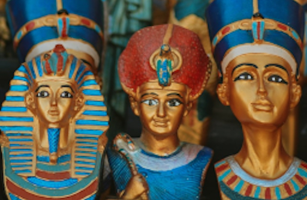
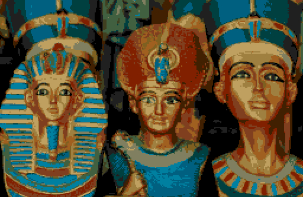

# python-megadrive-mdtiletool
A tool for converting images to MegaDrive tile and pallete format.

This is a barebones but working tool. JPEG images seems to work best.

Output is written to stdout.

Requires Python Pillow (PIL)

There are probably much better tools than this (but this one is super simple to use) e.g:

[mdtiler](https://github.com/sikthehedgehog/mdtools)

[Retro Graphics Toolkit](https://github.com/ComputerNerd/Retro-Graphics-Toolkit)

# Example
```shell
./mdtiletool.py misc/image-orig.jpg > image.asm
```

Resulting output looks like this
```shell
Palette0:
  .word 0x0000
  .word 0x06AC
  .word 0x048A
  .word 0x0688
  .word 0x0A80
  .word 0x026A
  .word 0x0268
  .word 0x0464
  .word 0x0860
  .word 0x0248
  .word 0x0028
  .word 0x0244
  .word 0x0024
  .word 0x0440
  .word 0x0222
  .word 0x0000
Image0:
  .long 0x9ACCCCBE
  .long 0x99CCCCEE
  .long 0x99CCCEEE
  .long 0x99CCCEEE
  .long 0x9BCCEEEE
  .long 0xBBCCEDEE
  .long 0xBCCCEDDE
  .long 0xBCCCEDDE

  .long 0xDDDDD888
  .long 0xDDDDD888
  .long 0xDDDDD888
  .long 0xDDDDD888
  ......
```

# Example Images
Original image (x2 scaled from original)



Resulting image (x2 scaled from original) grabbed from emulator



Image credit:
[Mohammed Hassan](https://unsplash.com/@moh_ph)
